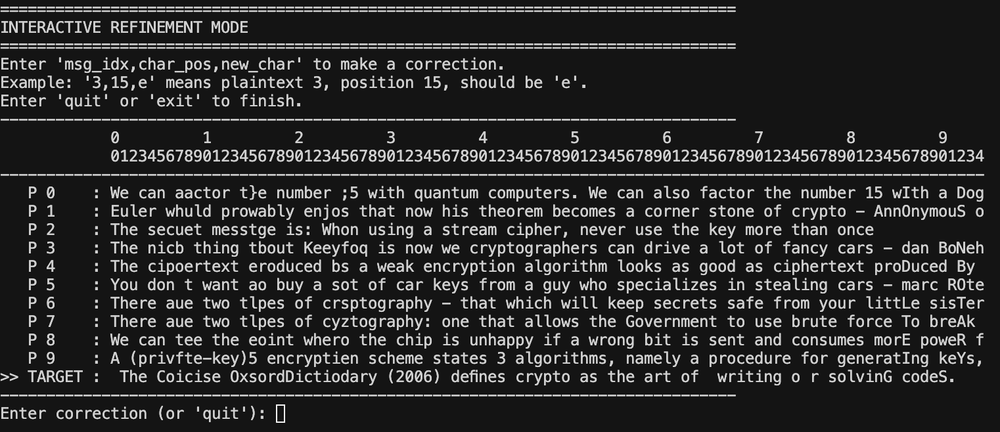

# Many-Time Pad Attack Solver

### I, How to Use the Tool

1.  **Prepare Your Ciphertexts:**
    *   Create a directory, for example, named `ciphers`.
    *   Inside this `ciphers` directory, place each of your 10 ciphertexts into its own file. Name them sequentially (e.g., `c0.txt`, `c1.txt`, `c2.txt`, etc.) to keep them in order.
    *   **Important:** Each file must contain the ciphertext encoded as a hexadecimal string. For example, the content of `c0.txt` might look like: `1a2b3c4d...`

2.  **Run from the Command Line:**
    *   Run the script by pointing it to your `ciphers` directory and specifying your target ciphertext index. For instance, if you want to decrypt the message from `c10.txt`, its index is `10`.

    **Example Command:**

    ```bash
    python solve.py --directory ciphers/ --target 10
    ```

    Or using the short flags:

    ```bash
    python solve.py -d ciphers/ -t 10
    ```
3. **Correct wrong characters if needed**

For example, cipher 2 secuet should be secret => Enter `2,7,r`. When you finish, type quit and get the final results

### II, Core Logic:
1.  **Scoring (`score_text` function):**
    *   "Brain" of the automation. It evaluates a decrypted byte based on a pre-defined `SCORING_TABLE`.
    *   Common English letters and especially the space character are given high positive scores.
    *   Non-printable characters (like control codes) are given a strong negative score because they are rare in plain text.

2.  **Guessing:**
    *   Loop through every single byte position of the ciphertexts.
    *   For each position, try all 256 possible values for the key byte (`0x00` to `0xFF`).
    *   For each guess, we will decrypt the corresponding byte in *all* ciphertexts and scores the resulting column of characters using `score_text`.
    *   The key byte that produces the highest overall score (the most "English-like" column) is chosen as the correct key byte for that position.

### How I Build This Attack
1. **Read documents about Multi Pad Attack and prepare the core ideas**
    * `guess` is the core concept in this attack as when we xor c0 and ct we got m0 xor m1. If we can guess m0 or m1 we can xor and get the other message in plain text
    * However, it requires us to gues character by character which is very slow. I research for a automated approach that speed up the process and make the `guess` process become easier.
    * I find out that we can try 0 to 256 ascii characters for each char spot and give score and then choose the best one. (`scoring method`)
2. **Prepare prompt for the AI to process base on what i have researched**
```
You are a professional Developer and also have many knowledge in security
I am working on Multiple Pad Attack problem
I am provided with 10 ciphertext encrypt using the same key
And a target cipher text need to decrypt back to normal text
I have read through some project that the idea is when we xor c1 and c2, we will get m1 xor m2 and if we take (m1 xor m2) xor (guess content) and if guess content is good and is m1 or m2 we can get the other message in plaint text quickly
=> Core idea is to guess char by char of target text to see if which char make other cipher text decrypt make sense and repeat until. we complete

+ We can use score method to try 0 to 256 ascii chars and choose the most suitable one for a position and then repeat
```
3. **Add improvements**
    * The automated process works well but not perfect as there will be some wrong characters in some ciphers text => `I add interactive mode so we can guess those wrong characters manually in order to get the perfect key to decrypt target cipher`
